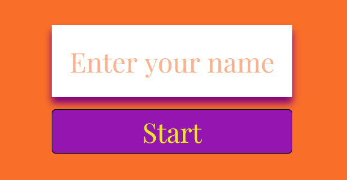
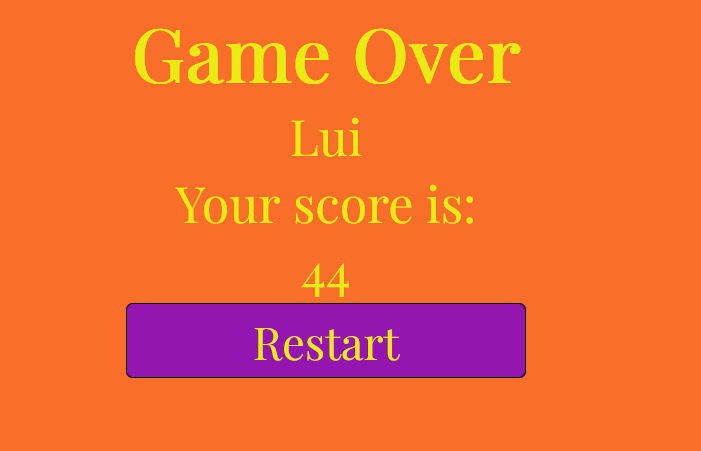
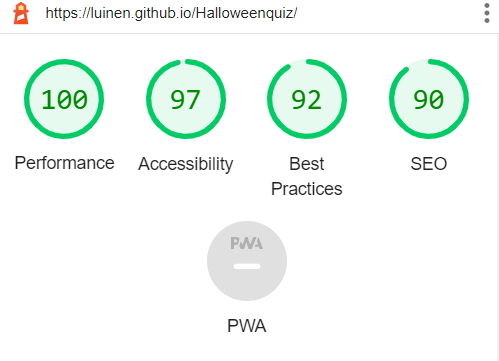
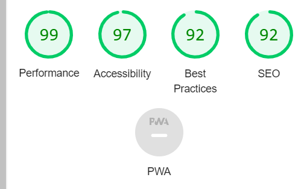
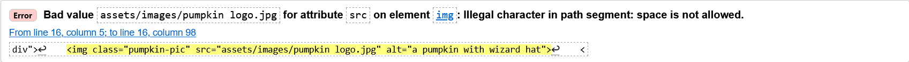
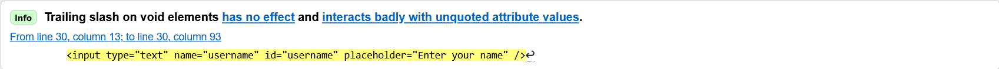
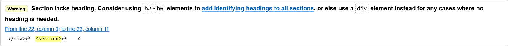
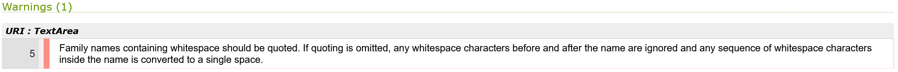
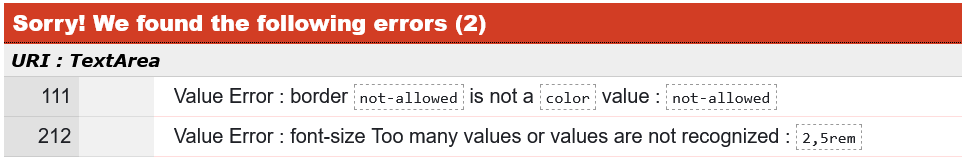
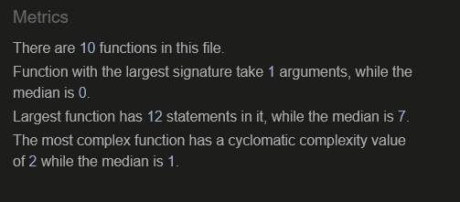

# Spooky Halloween
  

**Welcome to [Spooky Halloween](https://luinen.github.io/Halloweenquiz/)!**
  

Spooky Halloween is a Halloween-related quiz game. This small game gives you 5 minutes of fun for people who like exciting facts and want to learn something new. Here's an excellent chance to prove to your relatives that you are the smartest and luckiest family member.  The game is simple and enjoyable. 


## Features

I explain the website features below.

### **Existing features**
  

- **Main menu**
  - A solid page with Halloween style, you can see the instructions. 
  - If you click on the start button, the username page appears.
  - The active button appears with black border and purple box shadow , which highlights it from the background.

  

- **Username**
  - The users can enter their names, and if they don't enter anything, an error message pops up.. The form is easy to use and the placeholder helps the users.



- **4 choices**
  - You can choose four different answers, and the active answer works the same as the main menu buttons.


  - Once the users have selected the answer, they have to use the check button to finalize it. After that, the users can not choose another answer because of the disabled button function.
  - If you choose the good answer, the background of the answer will be green.
  


  - But if you choose the wrong answer, it will be red.


- **Score**
  - The users receive 5 points for each correct answer. Wrong answers give them -1 point.


- **Game Over page**
  - At the end of the quiz, the users can see their high score or go back to the main menu and play again. 



 - **Footer**
  - The users can click on the social media links at the bottom of the page.


### **Features left to implement**
- I think a timer or a countdown would be a good idea to add to this quiz
- I want to add a progress bar next to the score

## Testing

  - The game works as intended. 
  - The users can't progress to the next page unless they enter their names.
  - The check button never gives you a false result.
  - The scoring system is okay. It gives you 5 points for each correct answer and subtracts 1 point for a wrong answer.
  - I tested each button and answers.
  - Responsiveness is good enough for every platform.
  - The game-over page always shows the current username and their scores.

#### **Lighthouse testing**

I used lighthouse to check the performance of my home page for mobile devices and desktop. The first time running the lighthouse, my SEO value was 80. After I added 'meta', the figures increased. I will try to set the aspect ratio better next time.
- Desktop version

- Mobile version
 

#### **Validator Testing**

- **HTML**
  - First time running the html validator I got 1 error, 1 info and 1 warning message: 

  
  - I renamed the image that fixed the issue.
  
  - deleted the slash end of the input
  
  - and deleted the section, because it was unnecessary.

  - After these mistakes were fixed, no errors were returned when passing through the official [W3c validator](https://validator.w3.org/)
- **CSS**

  - First time running the css validator I got 2 errors and 1 warning message: 

  - I deleted the space and I used quotes, and the problem solved.
    ```
    font-family:"Playfair Display", sans-serif;
    ```
    

  - I changed 'not-allowed' to 'none' and I deleted the unnecessary font-size.

  - After these mistakes were fixed, no errors were returned when passing through the official [Jigsaw](https://jigsaw.w3.org/)


- **JS**
  - I tested my codes continuously with the JS validator during my work. I made many mistakes. For example, I often used the wrong keyword when I defined variables(let and const, var).
  - My code wasn't clean, so I put every variable at the top of the page, then the array and functions.
  - missing or unnecessary semicolons


  - After these mistakes were fixed, no errors were returned when passing through the official [JS validator](https://jshint.com/)

## Bugs

 - The questionIterator was 0, and I thought the isCorrect didn't work. After I set it to 1, it solved a problem.
 - I tried to use sessionStorage to save the username and score, but I had error messages, so I changed it to localStorage.
 - The resetButtonStyle and setAnswerButton functions didn't work with getElementsByClass(only with one button at a time, not with all of them), so I used getElementById.

## Deployment  

- The site was deployed to GitHub pages. The steps to deploy are as follows: 
  1. In the GitHub repository, navigate to the Settings tab.
  2. From the source section drop-down menu, select the Master Branch.
  3. Once the master branch has been selected, the page will be automatically refreshed with a detailed ribbon display to indicate the successful deployment.
  4. The live link can be found here: https://luinen.github.io/Halloweenquiz/

- If you want to clone the repository:
  1. In the GitHub repository, click on the 'Code'.
  2. Click 'Open with GitHub Desktop' to clone and open the repository with GitHub Desktop.
  3. Click 'Choose...' and, using the Finder window, navigate to a local path where you want to clone the repository. 
  4. Click Clone.  


## Credits

#### Content

- The questions for the quiz were taken from [Parade](https://parade.com/1066846/jessicasager/halloween-trivia/).
- Instructions of the container were taken from  [Web Dev Simplified](https://www.youtube.com/c/WebDevSimplified)
- The idea of the rules was taken from [CodingNepal](https://www.youtube.com/c/CodingNepal)

#### Media 

- The pumpkin image was taken from [Dribble](https://dribbble.com/). 